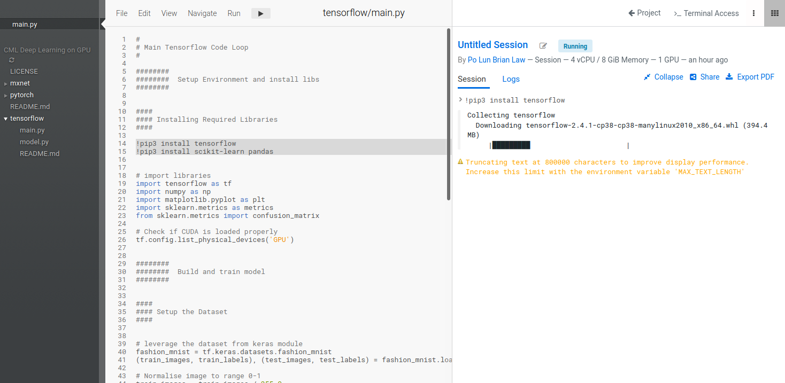
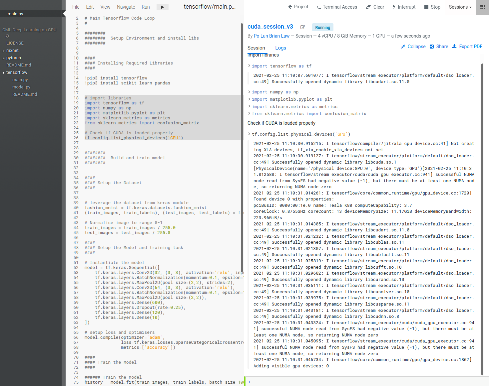
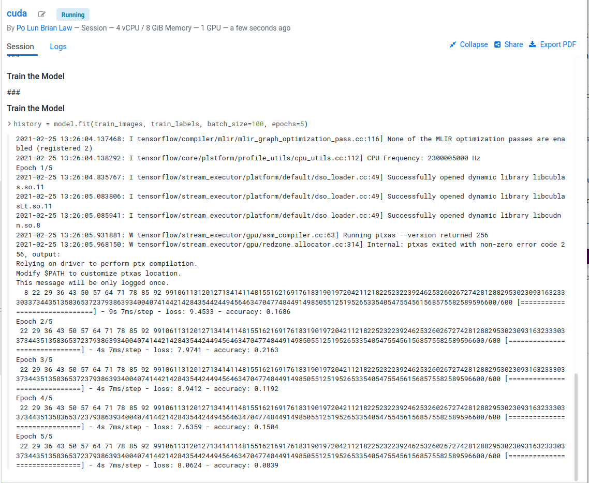
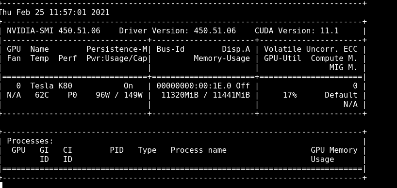

# Deep Learning with CML Runtimes with Cloudera Machine Learning

Support Repo for blog article on Nvidia GPU Runtimes in CML

## Introduction

In our previous article, we demonstrated how to setup sessions in Cloudera Machine Learning (CML)'s to access Nvidia GPUs for accelerating Machine Learning Projects.
When leveraging GPUs, a lot of the time can be lost wrangling with Nvidia drivers, CUDA versions and custom CML engines. With CML, we will simplify it somewhat for you.

To show off how easily Data Scientists can get started with GPU compute on our platform, I will show three ways to go from 0 to GPU trained model deeplearning model with CML.

## Scenario

To illustrate how to leverage these Nvidia GPU Runtimes, I will use a Computer Vision Image Classification example.
We will train deeplearning models to classify fashion items leveraging the Fashion Mnist Dataset. 

MNIST, a handwritten digits classification task, has been the Computer Vision 101 sample problem for years involving the classification of handwritten numerical digics. The problemset, however, hasn't kept up to the times and modern GPUs and algorithms will solve it faster than it takes for you to read this paragraph.

Fashion MNIST is a tougher classification challenge, designed as a drop in replacement. With the Fashion MNIST dataset, our algorithm has 10 different classes of clothing items to identify with 10,000 samples of each.

## Libraries

For this article, I will provide code in PyTorch, Tensorflow and MXNet for you to follow along.
See the relevant subfolders `pytorch`, `mxnet` and `tensorflow` respectively.

## Tutorial

Each folder contains a `main.py` function that contains the code to install the libraries, load the data, setup the network and train the model. I will go over the tensorflow one in the following screenshots.

Firstly, git clone the repo into a new project.

Once it has all loaded, you will land into the project page.

From there you can create a new session. When creating a session, we can choose from different CPU / RAM and GPU configurations. In my case, I have selected 4 cores / 8GB RAM and 1 GPU. With FashionMNIST, 1 GPU is enough for us to fit the algorithm relatively quickly. For more advanced problems and with more complex deep learning models, more GPUs maybe needed. The techniques for leveraging multiple GPUs for deeplearning however can get complicated so I won't go over that today. 

In the following examples, I will use the native CML IDE but Jupyter is baked into CML as well should you prefer that.

With our IDE and session available, we now need to install the relevant libraries. In the `main.py` script in my tensorflow subfolder you can see the pip commands to install the libraries at the top. For Ipython which is what we are running for interactive coding, `!pip3` is how we run `pip` without having to go to a bash terminal. 

Run these two lines to get the libraries installed. This can be done by selecting the two lines and hitting `Ctrl+Enter`

With the libraries installed, we can run the librarie import statements a quick check to make sure that `tensorflow` is correctly leveraging our gpu resource.

---
**NOTE** Libraries like tensorflow are normally packaged and released onto pypi and conda channels for specific Nvidia CUDA versions down to the point release. CUDA 11.0 libraries may have issues with CUDA 11.1 for example. 

If there is a mismatch between the CUDA version installed and what the packaged library was compiled with it maybe necessary to recompile the library for it to work.

---

To see how much we are using the GPU I will open a terminal session and load the `nvidia-smi` tool to track usage. Run the command `nvidia-smi -l` to open a refreshing tracker for GPU utilisation

Now we can run the rest of the script and watch our model train

When our model is trained we can look at the model training results to see how good our model is.

## More to come

In this post, we reviewed how to start up a GPU enabled Cloudera Machine Learning Session and showed off how to leverage the GPU for deep learning applications. 