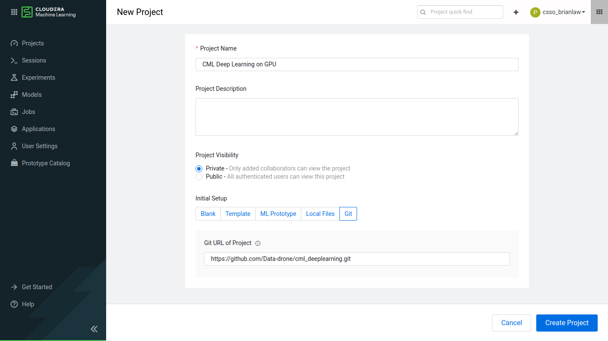
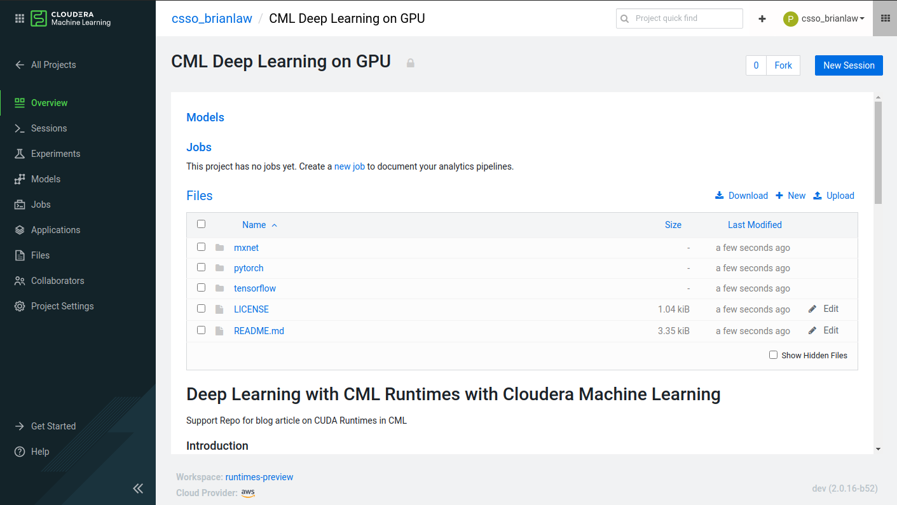
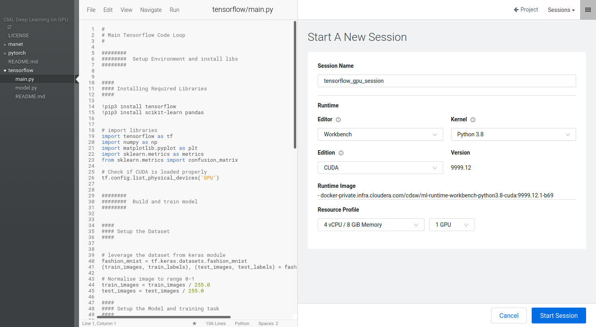
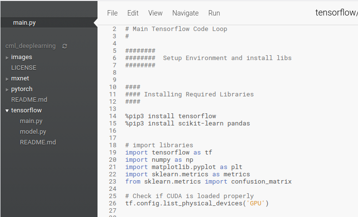
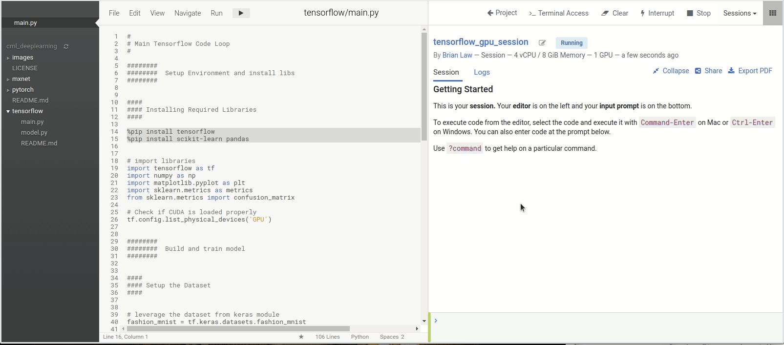
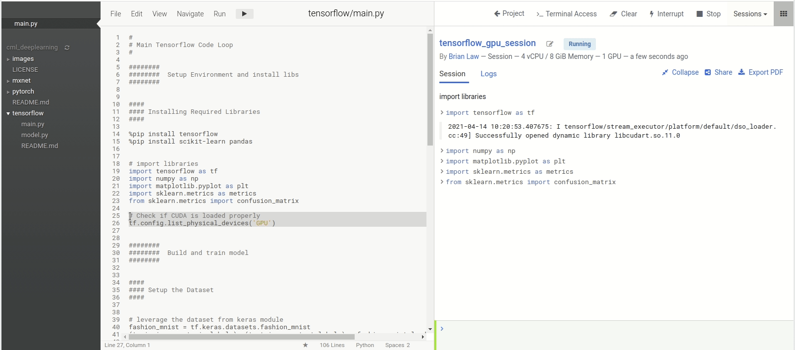
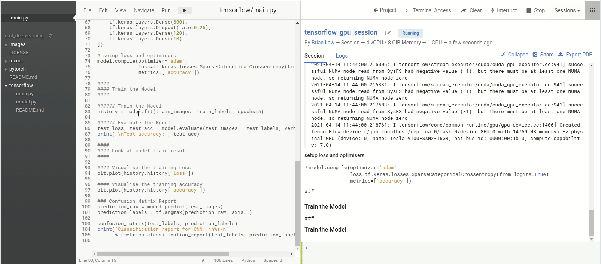
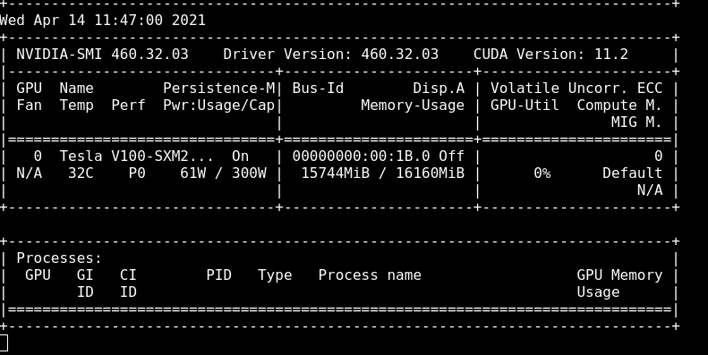
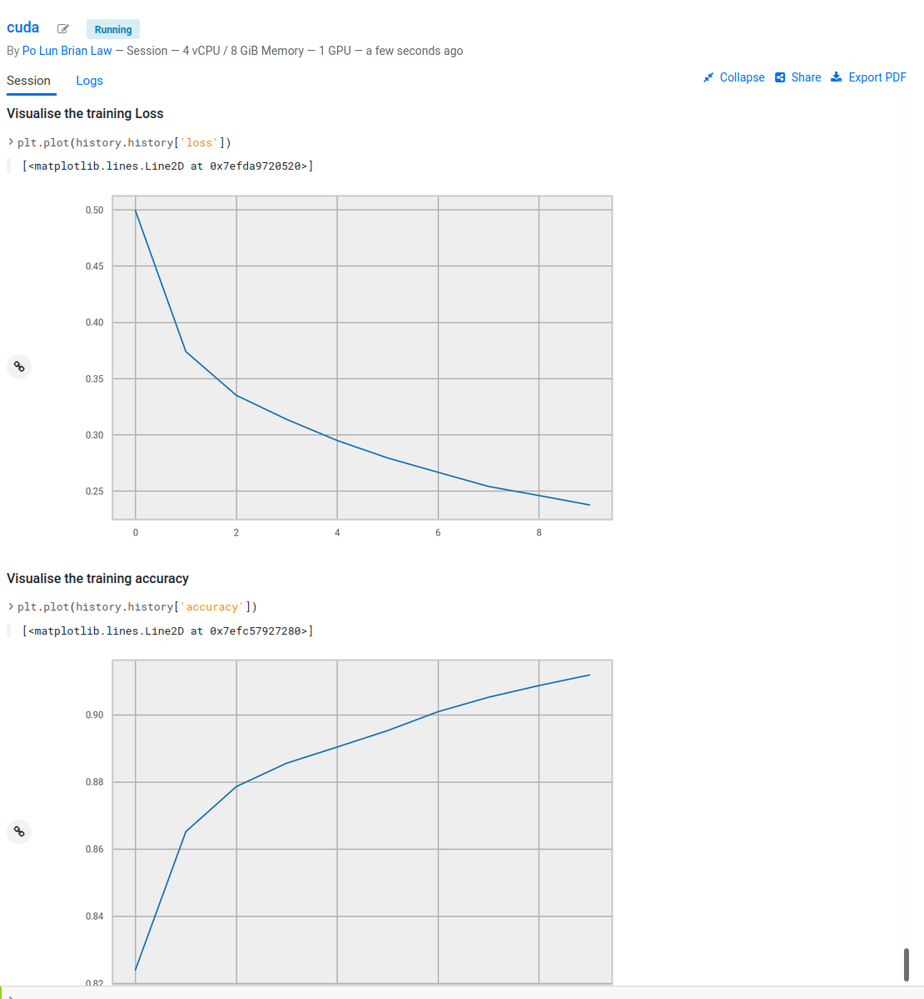

# Deep Learning with GPUs in Cloudera Machine Learning

Support Repo for blog article on Nvidia GPU Runtimes in CML

## Introduction

In our previous blog post in this series, we explored the benefits of using GPUs for data science workflows, and demonstrated how to set up sessions in Cloudera Machine Learning (CML) to access NVIDIA GPUs for accelerating Machine Learning Projects. While the time-saving potential of using GPUs for complex and large tasks is massive, setting up these environments and tasks such as wrangling NVIDIA drivers, managing CUDA versions and deploying custom engines for your specific project needs can be time consuming and challenging. To make these processes simpler — and to get data scientists working on ML use cases faster — we made it simple to configure and leverage NVIDIA GPUs natively in CML. In the next sections, We’ll provide you with three easy ways data science teams can get started with GPUs for powering deep learning models in CML, and demonstrate one of the options to get you started.

## Scenario

To illustrate how to leverage these NVIDIA GPU Runtimes, we will use a Computer Vision Image Classification example and train a deep learning model to classify fashion items leveraging the Fashion MNIST Dataset. 

MNIST, a handwritten digits classification task, has been the Computer Vision 101 sample problem for years involving the classification of handwritten numerical digits. The problem set, however, hasn't kept up to the times and modern GPUs and algorithms are now able to solve it faster than it takes you to read this paragraph.

Fashion MNIST is a tougher classification challenge, designed as a drop in replacement. With the Fashion MNIST dataset, our algorithm has 10 different classes of clothing items to identify with 10,000 samples of each.
## Libraries

For this article, I will provide three approaches to tackling this scenario using code in PyTorch, Tensorflow and MXNet for you to follow along. See the relevant subfolders `pytorch`, `mxnet` and `tensorflow` respectively. For this post, we will be exploring how to use Tensorflow with NVIDIA GPUs. The other subfolders are executed in the same way and easy for you to self-explore. Follow along with the code here. Note that while we’re using the above methods for this exercise, GPUs are quite flexible and allow for the use of a wide range of frameworks and libraries natively depending on the project.

## Tutorial

Each folder (`pytorch`, `mxnet` and `tensorflow`) contains a `main.py` function with all the code required to install the libraries, load the data, set up the network and train the model. Let’s take a look at the tensorflow example in the following screenshots:

First, from the “New Project” tab on the homescreen, git clone the repo into a new project.

Once it has all loaded, you will land into the project page.

From there you can create a new session in the upper right hand corner of your project page. When creating a session, we can choose from different CPU / RAM and GPU configurations. In my case, I have selected 4 cores / 8GB RAM and 1 GPU. With FashionMNIST, 1 GPU is enough for us to fit the algorithm relatively quickly. For more advanced problems and with more complex deep learning models, more GPUs maybe needed. The techniques for leveraging multiple GPUs for deep learning however can get complicated so I won't go over that today. 

In the following examples, I will use the native CML IDE but JupyterLabis also available in CML should you prefer that.

With our IDE and session available, we now need to install the relevant libraries. In the `main.py` script in my tensorflow subfolder you can see the pip commands to install the libraries at the top. For Ipython which is what we are running for interactive coding, `%pip` is how we run `pip` without having to go to a bash terminal.  

Run these two lines to get the libraries installed. This can be done by selecting the two lines and hitting `Ctrl+Enter`

With the libraries installed, we can run the library import statements as a quick check to make sure that Tensorflow is correctly leveraging our GPU resource. You should see a series of “Successfully opened dynamic library xxxx” messages and finally “Adding visible gpu devices: 0”. The 0 is the index of the graphics card. Should you have more than 1 graphics card you will see extra indexes for example: “Adding visible gpu devices: 0, 1” 

---
**NOTE** Libraries like tensorflow are normally packaged and released onto pypi and conda channels for specific Nvidia CUDA versions down to the point release. CUDA 11.0 libraries may have issues with CUDA 11.1 for example. 

If there is a mismatch between the CUDA version installed and what the packaged library was compiled with it maybe necessary to recompile the library for it to work.

---

To see how much we are using the GPU I will open a terminal session and load the `nvidia-smi` tool to track usage. Run the command `nvidia-smi -l` to open a refreshing tracker for GPU utilisation

Now we can run the rest of the script and watch our model train

As our model is training, we can see that the Memory Usage has gone from 3MiB to 11320MiB and the Volatile GPU-Util is at 17% whereas before it was at 0%

Success! You’re now ready to start using GPUs in CML with Tensorflow. The other subfolders can be set up in the same way and are ready for you to explore on your own.

## More to come

In this post, we reviewed how to start up a GPU enabled Cloudera Machine Learning Session and showed off how to leverage the GPU for deep learning applications. 